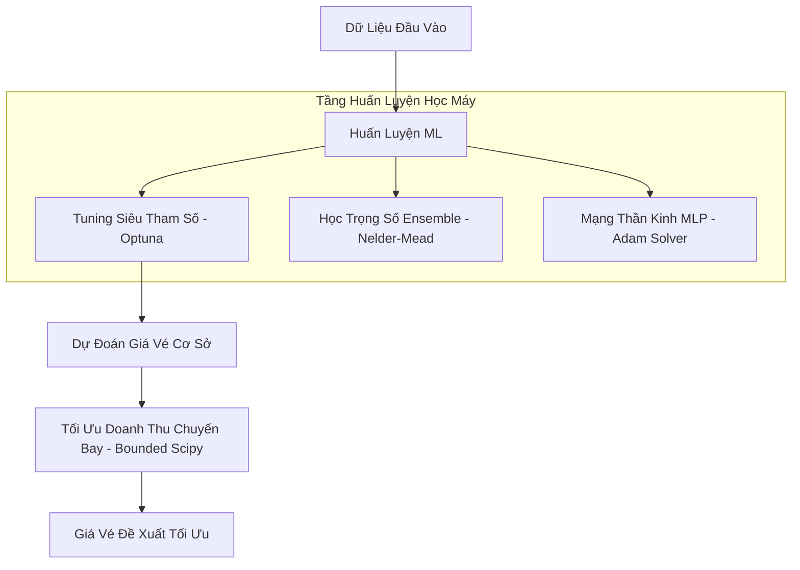
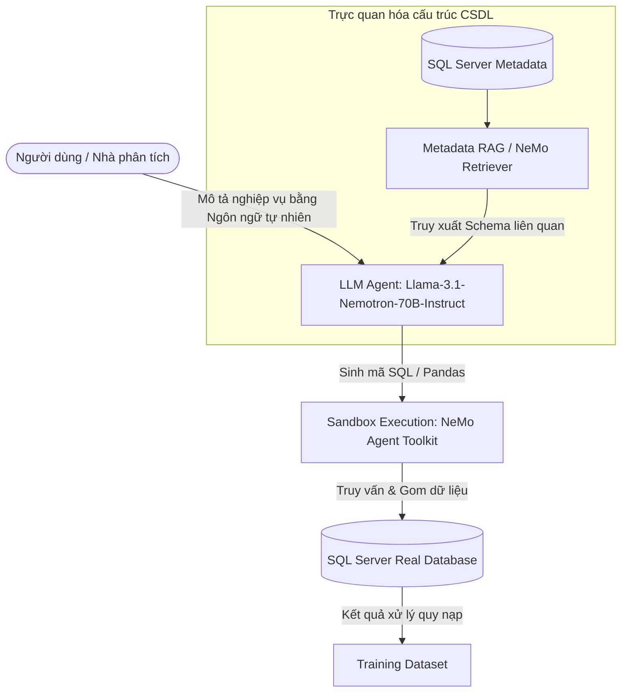

#  DỰ ĐOÁN GIÁ VÉ & TỐI ƯU DOANH THU

## 1. Nguồn Dữ Liệu Đầu Vào (Data Source)

*   **Nguồn gốc:** Dữ liệu được xử lý ở SQL Server sau đó nén lại thành file Zip và upload lên Google Drive (File ID: `1PE12XPZYKV8Rfn8KY9QTym69dYdxkFJk`), sau đó giải nén ra thư mục `data/AI_hackathon`.
*   **Định dạng:** Tập hợp nhiều tệp CSV đại diện cho dữ liệu giao dịch vé máy bay theo các mốc thời gian (ví dụ: `data_2025-10-02.csv`).
*   **Download dữ liệu:** Hàm `load()` trong module `data_loader.py`tự động tải/giải nén từ Drive, sau đó gộp tất cả thành một `DataFrame`.

---

## 2. Tiền Xử Lý Dữ Liệu (Data Preprocessing)

Các bước để làm sạch dữ liệu để chuẩn bị cho việc training:

### A. Xử lý giá trị Null/Missing Values
Để tránh hiện tượng **Rò rỉ dữ liệu (Data Leakage)**, hệ thống áp dụng kỹ thuật **Inductive Imputation (Điền khuyết quy nạp)**: *dữ liệu chỉ được điền sau khi đã phân chia tập Train/Valid/Test* và các giá trị thống kê dùng để điền khuyết được học (**fit**) *duy nhất trên tập Train*, sau đó áp dụng (**transform**) cho tập Valid và Test.
*   **Cột Target (`ticket_price`):** Tất cả các dòng bị thiếu giá trị mục tiêu (ticket price) sẽ bị xóa bỏ ngay từ đầu.
*   **Cột Số (Numerical Columns):** 
    *   Hệ thống kiểm tra mức độ lệch (Skewness) của từng feature trên tập Train.
    *   Nếu phân phối bị lệch (`Skewness >= 0.5`), sử dụng **Median** để điền khuyết nhằm tránh ảnh hưởng của nhiễu.
    *   Nếu phân phối ít lệch (`Skewness < 0.5`), sử dụng **Mean**.
*   **Cột Phân loại (Categorical Columns):** Các cột phân loại như hãng vé, hành trình... được xử lý bằng `LabelEncoder`. Đối với các giá trị bị thiếu (`NaN`), chúng tôi sẽ chuyển thành dạng string `"nan"` trước khi Encoder. Các nhãn mới xuất hiện ở tập Valid/Test chưa từng thấy ở tập Train sẽ được gán giá trị mặc định là `-1`.

### B. Các cột bị loại bỏ (Dropped Columns)
Việc thiếu dữ liệu của hãng khác so với Vietjet. Do đó, chúng tôi loại bỏ hoàn toàn:
1.  `competitor_price` (Giá vé đối thủ)
2.  `price_gap` (Khoảng cách giá với đối thủ)
3.  `price_gap_pct` (Tỷ lệ khoảng cách giá)
4.  `price_advantage_pct` (Tỷ lệ lợi thế giá)
5.  `competitor_name` (Tên đối thủ cạnh tranh)

*Ý nghĩa ML:* Việc loại bỏ các thuộc tính nhiễu này giúp mô hình dự đoán giá vé độc lập như nhu cầu, sức chứa, thời gian mua vé của Vietjet thay vì bị phụ thuộc vào thông tin động của đối thủ vốn rất khó thu thập chính xác trong thực tế.

### C. Lọc nhiễu & Dữ liệu ngoại lai (Outliers)
*   **Lead Time:** Loại bỏ các giao dịch có thời gian đặt trước vé (`lead_time_days`) nằm ngoài khoảng từ `0` đến `365` ngày.
*   **Giá vé tối thiểu:** Chỉ giữ lại các giao dịch vé có giá trị `ticket_price >= 50.000` VND để loại bỏ dữ liệu lỗi hoặc vé tặng không đồng.
*   **Cắt giảm Load Factor:** Các chỉ số tỷ lệ lấp đầy (`LF_by_date`, `LF_by_fare`) được giới hạn (clip) trong khoảng từ `0.0` đến `1.0` (quy đổi về dạng phần trăm chuẩn).
*   **Loại trùng lặp:** Loại bỏ các bản ghi trùng lặp tuyệt đối thông qua.

---

## 3. Feature Engineering

Từ các thông tin input ban đầu, chúng tôi đã thêm các đặc trưng nâng cao nhằm tăng khả năng biểu diễn của mô hình:

### A. Time-based Features
Trước hết chúng tôi nhận thấy thời gian bay, thời gian book vé cũng có thể ảnh hưởng đến giá vé. Nhứng time này có thể là mùa cao điểm như các dịp lễ, hay mùa hè,...
*   `dep_month`, `dep_quarter`, `dep_day_of_month`: Lấy thông tin tháng, quý, ngày trong tháng từ ngày khởi hành.
*   `booking_month`: Tháng thực hiện đặt vé.
*   `is_weekend`: Nhận diện ngày đặt vé có rơi vào cuối tuần hay không (Weekday = 5 hoặc 6).
*   `is_peak_season`: Đặc trưng nhị phân (0/1) xác định tháng cao điểm bay của Việt Nam (Tháng 1 & 2 - Dịp Tết Nguyên Đán; Tháng 6, 7, 8 - Dịp cao điểm du lịch hè).

### B. Nhóm đặc trưng thương mại & hành vi (Commercial & Interaction Features)
*   `occupancy_rate` (Tỷ lệ lấp đầy ghế thực tế): Tính bằng `seats_sold / capacity` (giới hạn từ 0 đến 1).
*   `urgency_score` (Trọng số mà khách đặt gần ngày, giờ bay, càng gần ngày bay thì trọng số càng cao): Tính bằng tỷ lệ lấp đầy hiện tại chia cho số ngày đặt trước (`LF_by_date / (lead_time_days + 1)`).
*   `velocity_ratio` (Tỉ lệ đặt vé tương đối): Tính bằng tỷ lệ tốc độ đặt vé 3 ngày gần nhất so với 7 ngày gần nhất (`booking_velocity_3d / booking_velocity_7d`).
*   `seats_remaining` (Số ghế trống ước tính còn lại): Tính bằng `capacity * (1 - LF_by_date)`.
*   `days_bucket` (Phân nhóm khoảng đặt trước): Phân loại `lead_time_days` thành các nhóm rời rạc để thuật toán cây dễ phân nhánh (các khoảng bins: `-1, 3, 7, 14, 30, 60, 90, 365`).
*   `log_lead_time`: Lấy logarit tự nhiên `log1p(lead_time_days)` giúp giảm độ lệch phân phối của thời gian đặt trước.
*   `lf_velocity_interact`: Chỉ số tương tác giữa tỷ lệ lấp đầy hiện tại và tốc độ đặt vé 7 ngày (`LF_by_date * booking_velocity_7d`).
*   `expected_sold` (Số lượng ghế dự kiến đã bán): `capacity * LF_by_date`.
*   `route`: Kết hợp điểm đi (`dep`) và điểm đến (`arr`) ví dụ: `SGN-HAN`, sau đó mã hóa số nguyên (`route_enc`).

---

## 4. Danh Sách Đặc Trưng Đưa Vào Huấn Luyện (30 Features)

Mô hình học máy sử dụng tổng cộng **30 đặc trưng đầu vào (features)** để dự đoán giá vé mục tiêu (`ticket_price`):

| STT | Tên Đặc Trưng | Mô Tả | Loại Dữ Liệu |
| :--- | :--- | :--- | :--- |
| 1 | `lead_time_days` | Số ngày đặt trước ngày bay | Số thực (Float) |
| 2 | `booking_velocity_3d` | Tốc độ bán vé trong 3 ngày gần nhất | Số thực (Float) |
| 3 | `booking_velocity_7d` | Tốc độ bán vé trong 7 ngày gần nhất | Số thực (Float) |
| 4 | `LF_by_date` | Hệ số lấp đầy (Load Factor) theo ngày | Số thực (Float) |
| 5 | `LF_by_fare` | Hệ số lấp đầy theo hạng vé | Số thực (Float) |
| 6 | `capacity` | Tổng số ghế ngồi trên chuyến bay | Số nguyên (Int) |
| 7 | `Weekday` | Ngày trong tuần đặt vé (0 = Thứ 2, ..., 6 = Chủ Nhật) | Số nguyên (Int) |
| 8 | `IsHoliday` | Cờ báo ngày lễ (0: Ngày thường, 1: Ngày lễ) | Số nguyên (Int) |
| 9 | `is_oneway` | Cờ báo vé một chiều (1) hay khứ hồi (0) | Số nguyên (Int) |
| 10 | `fuel_price` | Chỉ số giá nhiên liệu hàng không tại thời điểm bán | Số thực (Float) |
| 11 | `count_sked` | Số lượng chuyến bay được lập lịch | Số nguyên (Int) |
| 12 | `fare_family_enc` | Mã hóa hạng vé (Fare Family) | Số nguyên (Đã mã hóa) |
| 13 | `fare_category_enc` | Mã hóa nhóm hạng vé (Fare Category) | Số nguyên (Đã mã hóa) |
| 14 | `route_enc` | Mã hóa tuyến bay (ví dụ: HAN-SGN) | Số nguyên (Đã mã hóa) |
| 15 | `urgency_score` | Điểm độ khẩn cấp đặt vé | Số thực (Float) |
| 16 | `velocity_ratio` | Tỷ lệ tốc độ đặt vé 3 ngày / 7 ngày | Số thực (Float) |
| 17 | `seats_remaining` | Số ghế trống còn lại ước tính | Số nguyên (Int) |
| 18 | `is_weekend` | Cờ báo đặt vé vào cuối tuần | Số nguyên (Int) |
| 19 | `days_bucket` | Mã hóa phân nhóm ngày đặt trước | Số nguyên (Int) |
| 20 | `log_lead_time` | Logarit của số ngày đặt trước | Số thực (Float) |
| 21 | `lf_velocity_interact` | Đặc trưng tương tác giữa Load Factor và tốc độ | Số thực (Float) |
| 22 | `expected_sold` | Số ghế dự kiến đã bán | Số thực (Float) |
| 23 | `dep_month` | Tháng khởi hành chuyến bay | Số nguyên (Int) |
| 24 | `dep_quarter` | Quý khởi hành | Số nguyên (Int) |
| 25 | `dep_day_of_month` | Ngày trong tháng khởi hành | Số nguyên (Int) |
| 26 | `booking_month` | Tháng thực hiện đặt vé | Số nguyên (Int) |
| 27 | `is_peak_season` | Cờ báo mùa cao điểm bay tại Việt Nam | Số nguyên (Int) |
| 28 | `str_Gender` | Đặc trưng giới tính hành khách | Số nguyên (Int) |
| 29 | `agency_currency_enc` | Mã hóa đơn vị tiền tệ của đại lý bán | Số nguyên (Đã mã hóa) |
| 30 | `occupancy_rate` | Tỷ lệ lấp đầy ghế ngồi thực tế | Số thực (Float) |

---

## 5. Mức độ ảnh hưởng của Feature lên giá vé

Dự án áp dụng ba phương pháp phân tích để đánh giá tầm quan trọng của từng đặc trưng đối với kết quả dự đoán giá vé.

### A. Correlation Matrix

- Xây dựng dựa trên hệ số tương quan Pearson giữa tất cả các biến số và biến mục tiêu `ticket_price`.
- Kết quả được lưu tại `outputs/eda_visualizations/correlation_heatmap.png`.
- Phương pháp này cho thấy mối quan hệ tuyến tính trực quan giữa từng đặc trưng và giá vé — ví dụ mức độ liên hệ của hệ số lấp đầy (`LF_by_date`) và số ngày đặt trước (`lead_time_days`) đối với giá được thiết lập.

### B. Feature Importance

- Các mô hình dạng cây quyết định như XGBoost, LightGBM và Random Forest cung cấp thuộc tính `feature_importances_`, đo lường mức độ quan trọng của từng đặc trưng dựa trên độ tăng thông tin (Gain) hoặc số lần được chọn để chia nhánh (Split Count).
- Biểu đồ so sánh Feature Importance của ba mô hình được lưu tại `outputs/feature_importance_comparison.png`, giúp xác định các đặc trưng đóng vai trò chủ đạo trong việc phân tách dữ liệu tại mỗi nút cây.

### C. Phân tích SHAP (Shapley Additive exPlanations)

- Để giải thích các mối quan hệ phi tuyến tính phức tạp một cách chi tiết, dự án sử dụng thư viện **SHAP** với lớp `TreeExplainer` áp dụng trên mô hình tốt nhất (XGBoost).
- Biểu đồ phân tích SHAP được lưu tại `outputs/shap_summary_best_model.png`.
- **Cách thức hoạt động:** SHAP đo lường đóng góp biên của từng đặc trưng vào kết quả dự đoán của từng mẫu dữ liệu cụ thể. Biểu đồ chỉ rõ đặc trưng nào làm tăng giá vé dự đoán (ví dụ: ngày bay cận kề, mùa cao điểm) và đặc trưng nào làm giảm giá vé dự đoán (ví dụ: đặt trước sớm, mùa thấp điểm).

---

Ba phương pháp trên được áp dụng ở các giai đoạn khác nhau trong quy trình. **Correlation Matrix** được sử dụng trong bước khám phá dữ liệu (EDA) để sàng lọc ban đầu, xác định các đặc trưng có khả năng ảnh hưởng đến giá vé. **Feature Importance** và **SHAP** được áp dụng sau khi huấn luyện mô hình, cho phép đánh giá chính xác mức độ đóng góp thực tế của từng đặc trưng dựa trên hành vi thực tế của mô hình.

---

## 6. Phân Chia Dữ Liệu & Huấn Luyện Mô Hình

### A. Cách chia dữ liệu (Train/Validation/Test Split)

Đối với dữ liệu chuỗi thời gian như giá vé máy bay, phân chia ngẫu nhiên (Random Split) sẽ gây ra hiện tượng **rò rỉ dữ liệu (data leakage)** — tức là mô hình vô tình "nhìn thấy" thông tin tương lai trong quá trình huấn luyện, dẫn đến đánh giá hiệu năng không thực tế. Do đó, dự án áp dụng **Phân chia theo thời gian (Temporal Split)**:

1. Toàn bộ dữ liệu được sắp xếp tăng dần theo ngày khởi hành (`departure_date`).
2. Dữ liệu được chia theo thứ tự thời gian với tỷ lệ sau:
   - **Train set (70%)** — phần dữ liệu sớm nhất, dùng để huấn luyện mô hình học các mẫu hành vi giá.
   - **Validation set (15%)** — phần dữ liệu tiếp theo, dùng để tối ưu siêu tham số và trọng số ensemble.
   - **Test set (15%)** — phần dữ liệu muộn nhất, dùng để đánh giá hiệu năng mô hình một cách khách quan và độc lập.
3. Kích thước thực tế sau khi phân chia:

   | Tập dữ liệu    | Số dòng    | Tỷ lệ |
   |----------------|------------|-------|
   | Train          | 2,694,752  | 70%   |
   | Validation     | 577,448    | 15%   |
   | Test           | 577,448    | 15%   |
   | **Tổng cộng**  | **3,849,648** | 100% |

### B. Danh sách các mô hình huấn luyện

Hệ thống huấn luyện song song **6 mô hình học máy độc lập** thuộc nhiều trường phái khác nhau:

| # | Mô hình | Đặc điểm nổi bật |
|---|---------|-----------------|
| 1 | **XGBoost Regressor** | Gradient boosting dựa trên cây, hiệu năng cao trên dữ liệu dạng bảng |
| 2 | **LightGBM Regressor** | Tối ưu tốc độ và bộ nhớ nhờ chiến lược phát triển cây theo chiều sâu (leaf-wise growth) |
| 3 | **CatBoost Regressor** | Boosting chuyên xử lý biến phân loại mà không cần encoding thủ công |
| 4 | **Random Forest Regressor** | Ensemble song song các cây độc lập, giảm thiểu phương sai (variance) hiệu quả |
| 5 | **Gradient Boosting Regressor** | Phiên bản boosting tiêu chuẩn của Sklearn, đóng vai trò mốc đối chứng (baseline) |
| 6 | **MLP Regressor** | Mạng nơ-ron truyền thẳng nhiều lớp, đại diện cho tiếp cận phi tuyến tính thuần túy |

**Mô hình thứ 7 — Weighted Ensemble:**
Thay vì chọn một mô hình duy nhất, hệ thống kết hợp đầu ra của cả 6 mô hình trên theo bộ trọng số tối ưu học được từ tập Validation. Cách tiếp cận này giúp triệt tiêu sai lệch đặc thù của từng mô hình đơn lẻ, cho ra dự đoán cuối cùng ổn định và chính xác hơn.

---

### C. Chuẩn hóa biến mục tiêu (Target Transformation)

Phân phối giá vé máy bay (`ticket_price`) thường bị **lệch phải nghiêm trọng** do một số giao dịch có mức giá bất thường cao. Nếu huấn luyện trực tiếp trên phân phối này, các mô hình dễ bị lệch theo những điểm ngoại lệ đó.

Để khắc phục, hệ thống áp dụng **QuantileTransformer** (cấu hình `output_distribution="normal"`) lên biến mục tiêu trước khi huấn luyện các mô hình Boosting (XGBoost, LightGBM, CatBoost):

- **Khi huấn luyện:** Mô hình học cách dự đoán trên không gian đã được chuẩn hóa về phân phối chuẩn.
- **Khi dự đoán:** Kết quả đầu ra được đưa qua hàm nghịch đảo (`inverse_transform`) để chuyển về đúng đơn vị tiền tệ gốc (VND).

---

## 7. Các Phương Pháp Tối Ưu Hóa (Optimizers)

Dự án áp dụng 4 phương pháp tối ưu hóa chuyên biệt ở các tầng công nghệ khác nhau:

### A. Tối ưu hóa siêu tham số mô hình (Hyperparameter Tuning với Optuna)
Nằm tại `kaggle/src/tuner.py`, dự án sử dụng **Optuna** để tìm kiếm không gian siêu tham số tối ưu cho XGBoost, LightGBM, và CatBoost thông qua việc cực tiểu hóa sai số MAPE trên tập Validation.
*   *Tham số tìm kiếm:* Số lượng cây quyết định (`n_estimators`), độ sâu tối đa (`max_depth`), tốc độ học (`learning_rate`), tỷ lệ lấy mẫu dòng/cột (`subsample`, `colsample_bytree`), v.v.

### B. Tối ưu hóa trọng số kết hợp (Ensemble Weights Optimization)
Tại `kaggle/src/trainer.py`, sau khi huấn luyện xong 6 mô hình độc lập, hệ thống tìm kiếm bộ trọng số kết hợp $(w_1, w_2, ..., w_6)$ sao cho giá trị dự đoán tổ hợp:
$$\hat{y}_{ensemble} = \sum_{i=1}^{6} w_i \cdot \hat{y}_i$$
đạt sai số **MAPE nhỏ nhất** trên tập Validation. 
*   **Thuật toán sử dụng:** Thuật toán tối ưu hóa đa chiều **Nelder-Mead** thông qua hàm `scipy.optimize.minimize`.

### C. Bộ tối ưu hóa doanh thu chuyến bay (Revenue Optimizer ở Backend)
Nằm tại `backend/src/models/optimizer.py`. Đây là tầng tối ưu thương mại chạy trực tiếp trên API server.
*   **Mục tiêu:** Tìm mức giá vé tối ưu ($price$) để đạt doanh thu lớn nhất cho mỗi chuyến bay.
*   **Mô hình toán học:** Sử dụng hàm cầu co giãn không đổi (Constant-Elasticity Demand Model):
$$Demand(Price) = BaseLF \times \left(\frac{Price}{BasePrice}\right)^{elasticity}$$
Với chỉ số co giãn mặc định $elasticity = -1.2$ (nghĩa là tăng giá 10% sẽ làm giảm lượng khách đặt chỗ khoảng 12%).
*   **Thuật toán tối ưu:** Sử dụng phương pháp tối ưu hóa ràng buộc một biến **Bounded Scalar Optimization** (`scipy.optimize.minimize_scalar` với phương thức `bounded`), tìm kiếm trong giới hạn cận dưới (`PRICE_LOWER_BOUND_PCT`) và cận trên (`PRICE_UPPER_BOUND_PCT`) so với giá gốc.

### D. Solvers huấn luyện nội bộ
Mô hình mạng thần kinh **MLP** sử dụng thuật toán tối ưu **Adam** (một phương pháp hạ gradient ngẫu nhiên thích nghi) làm solver huấn luyện để cập nhật các trọng số liên kết giữa các neuron.

---

## 8. Chỉ Số Đo Lường & Đánh Giá Độ Chính Xác (Model Evaluation Metrics)

Để đánh giá mức độ tin cậy của các mô hình trên tập Test độc lập, dự án sử dụng 4 chỉ số đo lường chuẩn mực của các bài toán hồi quy (Regression):

1.  **MAPE (Mean Absolute Percentage Error - Phần trăm sai số tuyệt đối trung bình):** Đo mức sai lệch trung bình theo tỷ lệ phần trăm so với giá trị thực tế. Đây là chỉ số trọng tâm nhất vì nó phản ánh trực tiếp rủi ro kinh tế của hãng hàng không.
2.  **RMSE (Root Mean Squared Error - Căn bậc hai sai số bình phương trung bình):** Phạt nặng các dự đoán lệch quá nhiều so với thực tế.
3.  **MAE (Mean Absolute Error - Sai số tuyệt đối trung bình):** Đo lượng sai lệch giá trị tuyệt đối tính bằng VND.
4.  **R² Score (Coefficient of Determination - Hệ số xác định):** Đo lượng phương sai của biến mục tiêu được giải thích bởi các đặc trưng đầu vào (Thang đo từ $0.0$ đến $1.0$, càng gần $1.0$ càng tốt).

---

## 9. Kết Quả Thực Nghiệm Trên Tập Test (Xếp Hạng Các Mô Hình)

Kết quả xếp hạng thực tế của các mô hình chạy trên tập Test độc lập (trích xuất từ `outputs/final_report.json`):

| Xếp Hạng | Mô Hình | MAPE (%) | RMSE (VND) | MAE (VND) | Hệ Số R² | Thời Gian Huấn Luyện (s) |
| :---: | :--- | :---: | :---: | :---: | :---: | :---: |
| **1** | **XGBoost (Best)** | **22.71%** | 1,124,685.56 | 374,121.67 | 0.7525 | ~103 giây |
| 2 | Weighted Ensemble | 22.80% | **1,121,311.29** | **373,674.25** | **0.7540** | *Kết hợp nhanh* |
| 3 | LightGBM | 23.33% | 1,127,356.90 | 378,722.17 | 0.7513 | ~52 giây |
| 4 | CatBoost | 25.90% | 1,235,362.87 | 424,042.29 | 0.7014 | ~82 giây |
| 5 | Random Forest | 30.42% | 1,193,730.52 | 414,902.52 | 0.7212 | ~1009 giây |
| 6 | Gradient Boosting | 37.21% | 1,252,819.83 | 461,450.36 | 0.6929 | ~4403 giây |
| 7 | MLP Neural Network | 46.97% | 1,315,123.65 | 529,591.01 | 0.6616 | ~7641 giây |

### Nhận xét & Đánh giá của Chuyên gia ML:
1.  **Mô hình tốt nhất:** **XGBoost** đạt hiệu năng đơn lẻ vượt trội nhất với sai số phần trăm trung bình thấp nhất (**22.71%**).
2.  **Sức mạnh của Ensemble:** Mô hình **Weighted Ensemble** đạt chỉ số tổng quan cực kỳ cân bằng. Nhờ phân bổ trọng số tối ưu gồm: **66.54% XGBoost**, **33.45% LightGBM** và **0.01% RandomForest**, mô hình Ensemble giảm thiểu được tối đa RMSE xuống mức thấp nhất (**1,121,311.29 VND**) và đạt hệ số xác định R² cao nhất (**0.7540**). Điều này có nghĩa là sự kết hợp giúp dự đoán tránh các lỗi sai lệch lớn tốt hơn mô hình đơn lẻ.
3.  **Tốc độ huấn luyện:** LightGBM cho thấy hiệu năng cực kỳ tốt so với thời gian huấn luyện (chỉ 52 giây để đạt MAPE 23.33%). Ngược lại, MLP và Gradient Boosting thông thường tốn hàng giờ huấn luyện nhưng hiệu năng kém hơn rất nhiều (MAPE lần lượt là 46.97% và 37.21%), do các đặc trưng dạng bảng phân loại có nhiều nhánh rời rạc rất khó biểu diễn tốt bằng mạng MLP nông nếu không qua các kỹ thuật nhúng phức tạp.

---

## 10. Kiến Trúc Tự Động Hóa Data Pipeline & Tối Ưu Hóa Trên Hệ Sinh Thái NVIDIA

Nhằm đáp ứng yêu cầu của Coach về việc áp dụng quy trình nghiệp vụ lên hạ tầng phần cứng và phần mềm do NVIDIA cung cấp, dự án FareCast AI đề xuất kiến trúc tích hợp toàn diện dưới đây:

### A. Kiến Trúc Tự Động Hóa Quy Trình Tổng Hợp Dữ Liệu (Automated Data Aggregation)

Kiến trúc này cho phép chuyển đổi ý định nghiệp vụ (business logic) của người dùng bằng ngôn ngữ tự nhiên thành một tập dữ liệu huấn luyện đã được làm sạch và hợp nhất thông qua các LLM tác tử (Agentic LLMs).

#### 1. Mô hình LLM Đề xuất (Intent & Code Gen)
*   **Llama-3.1-Nemotron-70B-Instruct:** Đây là mô hình tinh chỉnh (fine-tuned) tối ưu của NVIDIA trên nền tảng Llama 3.1, sử dụng tập dữ liệu preference HelpSteer2. Mô hình này đạt hiệu năng vượt trội trong việc hiểu ý định phức tạp của người dùng (Intent Understanding), lập luận logic, gọi công cụ (Tool Calling), và sinh mã nguồn (SQL/Python) để gom dữ liệu.
*   **Llama-3.3-70B-Instruct-NIM:** Lựa chọn thay thế hoặc nâng cấp thế hệ mới nhất, cung cấp khả năng hội thoại và sinh mã ổn định với chi phí tài nguyên tối ưu.
*   **Deployment (NVIDIA NIM):** Tất cả các LLM này được triển khai dưới dạng **NVIDIA NIM (NVIDIA Inference Microservices)**. NIM cung cấp các container được tối ưu hóa cực kỳ sâu bằng TensorRT-LLM và vLLM, giúp tăng thông lượng suy luận (inference throughput) trên GPU H200/H100 và cung cấp API chuẩn tương thích với OpenAI.

#### 2. Lớp truy xuất cấu trúc dữ liệu (Schema Retrieval Layer)
*   Để LLM không bị quá tải token khi đọc toàn bộ Schema của cơ sở dữ liệu lớn, chúng tôi sử dụng cơ chế **Metadata RAG** được xây dựng trên **NVIDIA NeMo Retriever**.
*   Khi người dùng yêu cầu gom dữ liệu (ví dụ: *"Gom dữ liệu đặt vé chặng SGN-HAN và điền khuyết giá"*), NeMo Retriever sẽ tìm kiếm các thông tin mô tả bảng (tables) và cột (columns) liên quan nhất từ cơ sở dữ liệu và nạp vào ngữ cảnh của LLM.

#### 3. Thực thi mã an toàn (Secure Execution Sandbox)
*   Mã SQL hoặc Pandas được sinh ra bởi LLM sẽ không được chạy trực tiếp lên database production mà được đưa qua một môi trường chạy an toàn (sandbox) được điều phối bởi **NeMo Agent Toolkit**.
*   Công cụ này cung cấp cơ chế bảo vệ (guardrails), kiểm soát lỗi cú pháp trước khi chạy thực tế để trả ra file dataset huấn luyện cuối cùng.

---

### B. Tăng Tốc GPU cho Huấn Luyện Machine Learning (RAPIDS & GPU Engines)

Để tận dụng tối đa sức mạnh của phần cứng NVIDIA (như GPU H200), toàn bộ các mô hình học máy dạng bảng (Tabular models) trong FareCast AI đã được cấu hình tối ưu để chạy trên GPU thay vì CPU.

#### 1. Tối ưu hóa các thuật toán Boosting (XGBoost, LightGBM, CatBoost)
Các mô hình boosting trong dự án đã cấu hình chạy trực tiếp trên GPU thông qua các thư viện hỗ trợ gốc (Native GPU Acceleration):
*   **XGBoost:** Sử dụng tham số `device="cuda"` (hoặc `tree_method="hist"` với GPU backend). XGBoost thực hiện phân nhánh cây song song cực nhanh trên GPU CUDA, giúp giảm thời gian huấn luyện từ vài phút xuống còn vài giây.
*   **LightGBM:** Sử dụng tham số `device="gpu"` trong `LGB_PARAMS`. Tăng tốc độ phân tách nút cây dựa trên GPU.
*   **CatBoost:** Sử dụng tham số `task_type="GPU"`. CatBoost hỗ trợ GPU cực kỳ tốt, đặc biệt khi xử lý các biến phân loại (categorical) có số lượng lớp lớn.

#### 2. Tăng tốc Scikit-Learn với RAPIDS cuML
Đối với mô hình **Random Forest** hoặc các bước tiền xử lý chuẩn hóa dữ liệu vốn sử dụng CPU của Scikit-Learn, dự án đã tích hợp giải pháp **RAPIDS cuML**:
*   **Zero-code-change Acceleration (`cuml.accel`):** Bằng cách gọi `%load_ext cuml.accel` hoặc `import cuml.accel`, toàn bộ các lệnh gọi Scikit-Learn (như `RandomForestRegressor`, `StandardScaler`, `LabelEncoder`) sẽ tự động được chuyển hướng thực thi trên GPU thông qua thư viện cuML mà không cần viết lại mã nguồn.
*   **Tích hợp trực tiếp:** Dự án đã viết lại hàm huấn luyện Random Forest trong `trainer.py` để tự động import `cuml.ensemble.RandomForestRegressor` khi phát hiện có GPU NVIDIA khả dụng, mang lại tốc độ xử lý nhanh hơn từ **10x đến 50x** so với Scikit-Learn nguyên bản trên CPU.
