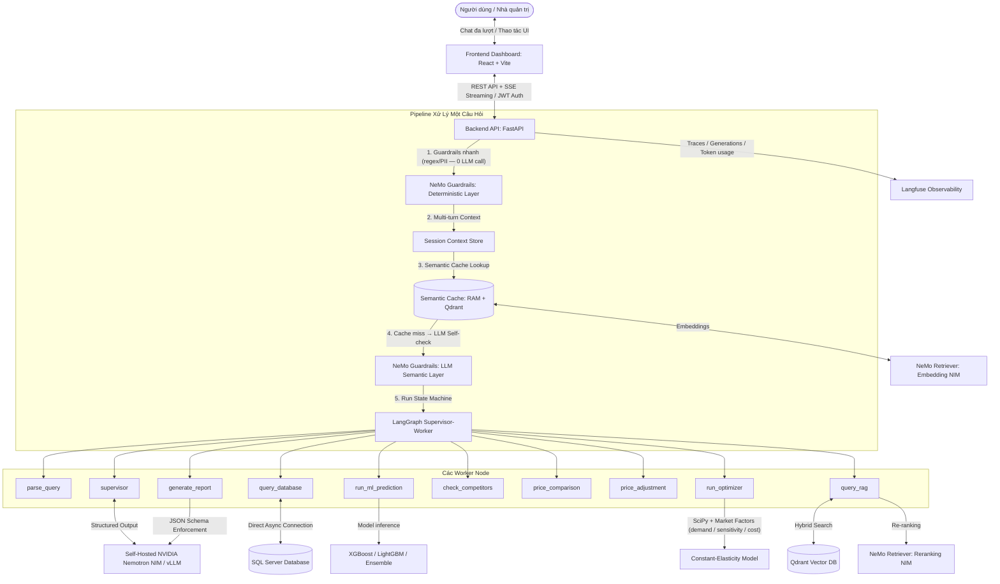

# VJ Revenue Optimizer — Trình Tối Ưu Hóa Doanh Thu Hàng Không (Agentic AI Copilot)

Dự án áp dụng **Machine Learning** kết hợp **Fullstack Web Application** nhằm dự đoán giá vé máy bay và tối ưu hóa doanh thu của các chuyến bay thương mại. Hệ thống được xây dựng trên kiến trúc **Tác tử Thông minh (Agentic AI Copilot)** sử dụng **LangGraph** (Supervisor–Worker), vận hành hoàn toàn trên hệ sinh thái **NVIDIA**: Nemotron LLM (self-hosted NIM/vLLM), **NeMo Retriever** (Embedding + Reranking NIM), **NeMo Guardrails**, kết hợp **Qdrant Vector DB**, **Semantic Caching**, **hội thoại đa lượt (Multi-turn)**, **SSE Streaming** và giám sát thời gian thực với **Langfuse Observability**.

---

## Kiến Trúc Hệ Thống (Architecture Overview)

Hệ thống bao gồm 3 thành phần cốt lõi:
1. **ML Training Pipeline (`kaggle/`)**: Quá trình ETL, xử lý sạch dữ liệu quy nạp (Inductive Imputation), xây dựng đặc trưng nâng cao (30 features), huấn luyện song song 6 mô hình ML và tối ưu hóa trọng số mô hình kết hợp (Weighted Ensemble).
2. **Backend API (`backend/`)**: FastAPI server chịu trách nhiệm tải dữ liệu chuyến bay từ SQL Server, suy luận (inference) thời gian thực qua các mô hình ML, chạy bộ tối ưu doanh thu (Revenue Optimizer) bằng SciPy với **độ co giãn cầu học từ dữ liệu** và **yếu tố thị trường trích xuất bằng LLM**, đồng thời vận hành **LangGraph Copilot Agent**.
3. **Frontend Dashboard (`frontend/`)**: Giao diện React (Vite) theo tone màu đỏ chủ đạo của **Vietjet Air**: danh sách chuyến bay, What-if simulation, khung chat Copilot với **tiến trình agent hiển thị live (SSE)** và bảng đề xuất giá theo từng chuyến bay / hạng vé.



---

## Các Công Nghệ & Giải Pháp Cốt Lõi

### 1. LangGraph State Machine (Supervisor–Worker Pattern)
Thay vì luồng xử lý tuyến tính cứng nhắc, hệ thống dùng **LangGraph** xây dựng máy trạng thái linh hoạt theo chiến lược **deterministic-first**:
*   **Supervisor Node:** Các workflow chuẩn (so sánh giá, điều chỉnh giá, tối ưu hóa) được điều phối bằng rule deterministic — nhanh, rẻ, dễ debug. Chỉ những câu hỏi không khớp rule mới gọi LLM Nemotron (structured output) để quyết định Worker tiếp theo, dựa trên **Agent Registry** (`agents/registry/*.md`).
*   **Worker Nodes độc lập:** `parse_query` (trích xuất hành trình/ngày/số hiệu, kể cả tên thành phố tiếng Việt), `query_database`, `run_ml_prediction` (dự báo giá Eco/Deluxe/SkyBoss), `run_optimizer`, `check_competitors`, `price_comparison`, `price_adjustment` (đối sánh cạnh tranh kiểu LCC), `query_rag` và `generate_report` (báo cáo JSON schema nghiêm ngặt, render thành **bảng đề xuất giá theo từng chuyến bay / hạng vé** kèm mức thay đổi VND và %).
*   **Fan-out song song:** Sau khi có dữ liệu chuyến bay, các worker ML + Competitor + RAG chạy song song để giảm tổng độ trễ.

### 2. Tối Ưu Doanh Thu với Yếu Tố Thị Trường (Market-Factor-Aware Optimizer)
Bộ tối ưu SciPy (mô hình cầu co giãn hằng số) được nâng cấp 3 tầng:
*   **Độ co giãn học từ dữ liệu:** Hồi quy log-log `ln(LF) = α + ε·ln(price)` theo từng chặng bay / hạng vé / mùa vụ, fallback về bảng hiệu chỉnh theo nghiên cứu ngành.
*   **Trích xuất yếu tố thị trường bằng LLM:** `MarketFactorAgent` đọc bối cảnh RAG và trả về danh sách yếu tố có cấu trúc `{name, type, direction, magnitude, confidence}`; có keyword fallback khi LLM không khả dụng.
*   **Tổng hợp liên tục, trọng số theo độ tin cậy:** Các yếu tố **cộng gộp và triệt tiêu lẫn nhau** (lễ hội + bão không còn "thắng ăn cả"); độ lớn được nhân với confidence — tín hiệu càng bất định thì điều chỉnh càng bảo thủ. Mỗi loại yếu tố tác động đúng đòn bẩy kinh tế:
    *   `demand` → dịch chuyển nhu cầu nền (thang exp) + độ co giãn về gần 0;
    *   `price_sensitivity` → chỉ thay đổi độ co giãn;
    *   `cost` (nhiên liệu...) → nâng **sàn giá tối thiểu** (`cost_pressure_factor`), không bóp méo đường cầu.

### 3. Semantic Caching (Bộ Nhớ Đệm Ngữ Nghĩa)
Giảm 70–90% chi phí gọi LLM cho các câu hỏi lặp/tương đồng:
*   **Layer 1 (Exact Hash):** SHA-256 của câu hỏi (đã trộn ngày được resolve — "hôm nay" hỏi hôm khác sẽ không trùng hash) so khớp trong RAM với TTL (mặc định 2 giờ).
*   **Layer 2 (Semantic Similarity):** Embedding bằng **NeMo Retriever Embedding NIM** (`nv-embedqa-e5-v5`, fallback SentenceTransformer local), truy vấn cosine ≥ `0.92` trong **Qdrant** với **bộ lọc nghiêm ngặt theo chặng bay + số hiệu chuyến + ngày** — câu hỏi "ngày mai" không bao giờ trả nhầm kết quả cache của "hôm nay".
*   **Targeted Invalidation:** Áp giá mới qua `/api/flights/{id}/apply` sẽ tự động xóa cache của chặng bay liên quan.
*   Point ID deterministic (dẫn xuất từ SHA-256) đảm bảo upsert đúng bản ghi qua các lần restart.

### 4. NeMo Guardrails (Thứ Tự Tối Ưu Chi Phí)
Pipeline an toàn dựa trên **NVIDIA NeMo Guardrails** (Colang flows + custom actions), sắp xếp theo nguyên tắc *rẻ trước — đắt sau*:
*   **Tầng nhanh (trước cache, 0 LLM call):** kiểm tra độ dài, regex chống prompt injection, lọc out-of-scope, redact PII (SĐT/CCCD/passport/email) — cache hit vì vậy giữ được tốc độ mili-giây.
*   **Tầng ngữ nghĩa (chỉ chạy khi cache miss):** LLM self-check đầu vào qua Nemotron.
*   **Tool-Call Gating:** kiểm tra tham số trước khi chạy tool (chống SQL injection, giá đề xuất phải nằm trong khoảng `50,000` – `50,000,000` VND).
*   **Output Review hợp nhất:** kiểm tra an toàn + lọc PII đầu ra trong **một lượt** Colang flow duy nhất; giá đề xuất được kiểm tra trên dữ liệu có cấu trúc (`report.recommended_price`) thay vì regex toàn văn bản.

### 5. Hội Thoại Đa Lượt (Multi-turn) & SSE Streaming
*   **Multi-turn Context:** Mỗi phiên chat ghi nhớ chặng bay / số hiệu / ngày đã giải quyết (TTL 30 phút). Câu hỏi nối tiếp như *"còn ngày mốt thì sao?"* tự kế thừa chặng bay của lượt trước; cache key được gắn tag ngữ cảnh nên không bao giờ va chạm giữa các phiên.
*   **SSE Streaming (`POST /api/agent/chat/stream`):** Backend phát sự kiện tiến trình theo từng node LangGraph (*"Đã truy vấn dữ liệu chuyến bay"*, *"Đã tối ưu hóa doanh thu"*...); frontend hiển thị live trong khung "đang suy nghĩ" và tự fallback về `/api/agent/chat` khi streaming không khả dụng.

### 6. NeMo Retriever RAG (Hybrid Search + Re-ranking)
*   **Hybrid Search:** Dense vector (Embedding NIM) + keyword boost trong Qdrant.
*   **Cross-encoder Re-ranking:** **Reranking NIM** (`nv-rerankqa-mistral-4b-v3`) chấm lại top candidates, fallback CrossEncoder local.
*   **Fallback chain đầy đủ:** Qdrant → keyword match → static data; NIM → model local. Hệ thống suy giảm dần (graceful degradation), không chết cứng khi một service down.

### 7. Langfuse Observability & Tracing
*   **Span & Trace:** Theo dõi thời gian từng Node trong LangGraph (kể cả các yếu tố thị trường được nhận diện cho optimizer).
*   **Generation Logging:** Prompt vào/ra, model, token tiêu thụ, latency để tối ưu chi phí.

### 8. Tối ưu hóa Database (Direct Async DB Connections)
*   Kết nối trực tiếp SQL Server (parameterized query, chống SQL injection) thay cho MCP subprocess cũ — giảm 200–500ms độ trễ mỗi yêu cầu.
*   File MCP Server (`backend/src/db/mcp_sqlserver.py`) vẫn được giữ cho external clients qua giao thức stdio.

---

## Cấu Trúc Dự Án (Project Structure)

```text
├── kaggle/                       # ML TRAINING PIPELINE (Huấn luyện và lưu mô hình)
│   ├── scripts/
│   │   └── run_pipeline.py       # Pipeline huấn luyện 6 mô hình ML
│   └── src/
│       ├── preprocessor.py       # Điền khuyết quy nạp & Feature Engineering
│       └── trainer.py            # Tối ưu trọng số Ensemble bằng Nelder-Mead
│
├── backend/                      # FASTAPI BACKEND SERVER
│   ├── config.py                 # Cấu hình môi trường (Directories, Optimizer bounds)
│   ├── src/
│   │   ├── db/
│   │   │   ├── sqlserver.py      # Kết nối trực tiếp SQL Server + chat sessions
│   │   │   └── mcp_sqlserver.py  # MCP Server cho external clients (stdio)
│   │   │
│   │   ├── models/
│   │   │   ├── trainer.py        # Load các mô hình ML (.pkl)
│   │   │   └── optimizer.py      # Revenue Optimizer (Elasticity + Market Factors + Cost Floor)
│   │   │
│   │   └── api/
│   │       ├── main.py           # Khởi tạo FastAPI & mount endpoints
│   │       ├── agent_graph.py    # LangGraph State Machine + Multi-turn + SSE stream
│   │       ├── semantic_cache.py # Semantic Cache (RAM + Qdrant, filter route/flight/date)
│   │       ├── guardrails.py     # NeMo Guardrails Pipeline (fast / semantic / output review)
│   │       ├── guardrails_config/# Colang flows (rails.co) + config.yml
│   │       ├── rag_service.py    # Qdrant RAG (Hybrid Search + NIM Re-ranking)
│   │       ├── competitor_service.py # Quét và đối sánh giá đối thủ
│   │       ├── schemas.py        # Pydantic request/response models
│   │       ├── auth.py           # JWT Auth & Rate Limit
│   │       │
│   │       ├── agents/
│   │       │   ├── prompts/      # Prompt Markdown: supervisor, report, market_factor...
│   │       │   └── registry/     # Mô tả năng lực từng Worker Agent (load vào Supervisor)
│   │       │
│   │       ├── services/
│   │       │   ├── nvidia_retriever.py # Singleton NIM Embedding/Rerank client + local fallback
│   │       │   └── prediction_service.py # Suy luận giá vé theo hạng
│   │       │
│   │       └── routers/          # Các router endpoints
│   │           ├── agent.py      # /agent/chat, /agent/chat/stream (SSE), /agent/sessions
│   │           ├── rag.py        # /rag/refresh — cập nhật tin tức thị trường
│   │           ├── flights.py    # Quản lý chuyến bay & áp dụng giá (invalidate cache)
│   │           ├── predictions.py# Suy luận giá vé ML
│   │           ├── optimization.py# Tối ưu giá vé SciPy
│   │           ├── dashboard.py  # Thống kê tổng quan
│   │           ├── health.py     # Health check (dùng cho Docker healthcheck)
│   │           └── db_ops.py     # Seed dữ liệu ban đầu
│   │
│   └── requirements.txt          # FastAPI, LangGraph, Qdrant, Langfuse, NeMo Guardrails...
│
├── frontend/                     # REACT/VITE FRONTEND (Dashboard & Chat Copilot)
├── outputs/                      # KẾT QUẢ HUẤN LUYỆN (.pkl models & biểu đồ)
├── docker-compose.gpu.yml        # Điều phối Container trên GPU Server
├── Dockerfile                    # Multi-stage Dockerfile cho Backend & Frontend
└── nginx.conf                    # Nginx Reverse Proxy cho Production
```

---

## Hướng Dẫn Thiết Lập Biến Môi Trường (`.env`)

Sao chép tệp `.env.gpu` thành `.env` ở thư mục gốc và cấu hình các tham số sau:

```ini
# Cấu hình Database
DB_NAME=airline_db
DB_SA_PASSWORD=YourSecurePassword123!

# Cấu hình LLM (NVIDIA Nemotron NIM / vLLM)
LLM_MODEL=nvidia/NVIDIA-Nemotron-3-Super-120B-A12B-NVFP4
VLLM_URL=http://vllm:8000/v1
NVIDIA_API_KEY=nvapi-your-key-here
VLLM_API_KEY=your-vllm-key-here          # Nếu dùng vLLM độc lập

# Cấu hình NeMo Retriever (Embedding + Reranking NIM)
NIM_EMBEDDING_URL=http://nim-embedding:8000/v1
NIM_RERANK_URL=http://nim-reranker:8000/v1
EMBEDDING_MODEL=nvidia/nv-embedqa-e5-v5
RERANK_MODEL=nvidia/nv-rerankqa-mistral-4b-v3
EMBEDDING_DIM=1024

# Cấu hình Vector DB (Qdrant) & Semantic Cache
QDRANT_URL=http://qdrant:6333
CACHE_TTL_HOURS=2.0
CACHE_SIMILARITY_THRESHOLD=0.92

# Cấu hình giám sát (Langfuse)
LANGFUSE_PUBLIC_KEY=pk-lf-default
LANGFUSE_SECRET_KEY=sk-lf-default
LANGFUSE_HOST=http://langfuse:3000

# Cấu hình bảo mật API
ENV=development                          # production để tắt dev-bypass
JWT_SECRET_KEY=your-jwt-secret-key-32-chars-long
DEV_BYPASS_TOKEN=your-dev-bypass-token
TOKEN_GEN_USER=vj_admin
TOKEN_GEN_PASSWORD=your-token-generation-password-here
```

---

## Hướng Dẫn Chạy Nhanh (Quick Start)

### Cách 1: Chạy trực tiếp trên máy cục bộ (Local Development)

#### Bước 1: Huấn luyện các mô hình Machine Learning
```bash
pip install -r kaggle/requirements.txt
python kaggle/scripts/run_pipeline.py
```
*Các mô hình và báo cáo so sánh sẽ tự động được lưu vào thư mục `outputs/`.*

#### Bước 2: Khởi chạy Backend API (Cần SQL Server, Qdrant và Langfuse cục bộ)
```bash
cd backend
pip install -r requirements.txt
uvicorn backend.src.api.main:app --reload --port 8000
```
*Tài liệu API trực quan: [http://localhost:8000/docs](http://localhost:8000/docs)*

#### Bước 3: Khởi chạy Frontend Dashboard
```bash
cd ../frontend
npm install
npm run dev
```
*Truy cập: [http://localhost:3000](http://localhost:3000)*

---

### Cách 2: Chạy thông qua Docker Compose (Khuyên dùng trên GPU Server)

Một lệnh duy nhất khởi chạy toàn bộ hệ sinh thái: Frontend + Backend + Nginx + Nemotron NIM + Embedding NIM + Reranking NIM + Qdrant + Langfuse:

#### Môi trường phát triển (Development Profile):
```bash
docker compose -f docker-compose.gpu.yml --profile dev up --build -d
```
*   **Frontend**: [http://localhost:3000](http://localhost:3000) (Hot Reload)
*   **Backend API**: [http://localhost:8020](http://localhost:8020)
*   **Qdrant Console**: [http://localhost:6333/dashboard](http://localhost:6333/dashboard)
*   **Langfuse Dashboard**: [http://localhost:4000](http://localhost:4000)

#### Môi trường Production:
```bash
docker compose -f docker-compose.gpu.yml --profile prod up -d --build
```
*   Frontend build tĩnh chạy qua **Nginx Reverse Proxy**.
*   **Truy cập Dashboard**: [http://localhost](http://localhost) (Cổng 80)

> [!NOTE]
> Backend có healthcheck tại `/api/health`; các container frontend chỉ khởi động sau khi backend báo healthy.

---

## API Endpoints Chính

| Endpoint | Phương thức | Mô tả |
| :--- | :---: | :--- |
| `/api/agent/chat` | POST | Chat với Copilot Agent (JSON response, hỗ trợ `session_id` đa lượt) |
| `/api/agent/chat/stream` | POST | Chat với tiến trình agent streaming qua SSE |
| `/api/agent/sessions` | GET | Danh sách phiên hội thoại |
| `/api/agent/status` | GET | Trạng thái kết nối vLLM/NIM |
| `/api/flights/{id}/apply` | POST | Áp dụng giá đề xuất (tự invalidate semantic cache) |
| `/api/predict` | POST | Suy luận giá vé ML cho một chuyến bay |
| `/api/optimize` | POST | Tối ưu giá vé bằng SciPy |
| `/api/rag/refresh` | POST | Cập nhật tin tức thị trường vào Qdrant |
| `/api/health` | GET | Health check & danh sách model đã load |

---

## Hiệu Năng Các Mô Hình Học Máy (Model Rankings)

Hệ thống đã huấn luyện và đánh giá trên tập kiểm thử độc lập gồm **577,448 dòng dữ liệu** (Temporal Split):

| Xếp Hạng | Mô Hình | MAPE (%) | RMSE (VND) | MAE (VND) | Hệ Số R² | Thời Gian Train |
| :---: | :--- | :---: | :---: | :---: | :---: | :---: |
| 1 | **XGBoost (Best Single)** | **22.71%** | 1,124,685.56 | 374,121.67 | 0.7525 | ~103s |
| 2 | **Weighted Ensemble** | **22.80%** | **1,121,311.29** | **373,674.25** | **0.7540** | *Kết hợp nhanh* |
| 3 | **LightGBM** | 23.33% | 1,127,356.90 | 378,722.17 | 0.7513 | ~52s |
| 4 | **CatBoost** | 25.90% | 1,235,362.87 | 424,042.29 | 0.7014 | ~82s |
| 5 | **Random Forest** | 30.42% | 1,193,730.52 | 414,902.52 | 0.7212 | ~1009s |
| 6 | **Gradient Boosting** | 37.21% | 1,252,819.83 | 461,450.36 | 0.6929 | ~4403s |
| 7 | **MLP Neural Network** | 46.97% | 1,315,123.65 | 529,591.01 | 0.6616 | ~7641s |

> [!TIP]
> *   **Weighted Ensemble** kết hợp đầu ra theo tỉ lệ: **66.54% XGBoost**, **33.45% LightGBM**, **0.01% RandomForest** — đạt R² cao nhất (**0.7540**) và RMSE thấp nhất.
> *   Dự án được tối ưu cho hệ sinh thái **NVIDIA**: GPU-native training cho XGBoost/LightGBM/CatBoost, tăng tốc Random Forest qua **RAPIDS cuML**, suy luận và RAG qua **NIM** + **NeMo Retriever**.

---

## Tài Liệu Tham Khảo Liên Quan
*   [SETUP.md](SETUP.md): Hướng dẫn chi tiết thiết lập môi trường, danh sách API endpoints và tham số.
*   [ML_EXPLANATION.md](ML_EXPLANATION.md): Tài liệu chuyên sâu về giải thuật ML, Feature Engineering, kết quả thực nghiệm và tích hợp NVIDIA.
